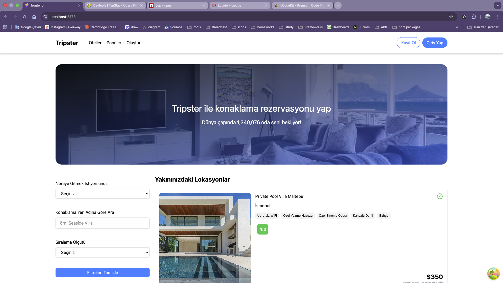
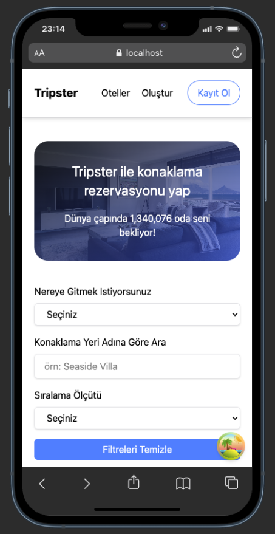

# Tripster Hotel Application

Easy Search and Filtering
Finding the perfect hotel among thousands is now easy. Filter by price, location, amenities, and more to match your needs.
Map View
Visualize hotel locations on an interactive map. Beach proximity, city center, or airport distance - evaluate everything at a glance.
Detailed Hotel Pages
Explore photos, features, pricing, and complete information for each hotel on dedicated pages.
Management Panel
Hotel owners can add new properties and update information through an admin interface.
User-Friendly Design
Modern and intuitive interface ensures seamless experience on both desktop and mobile devices.

## Properties and Used Techs

- react (19) and react-dom (19)
- react-router-dom (7)
- axios (1.x)
- tailwindcss (4) and @tailwindcss/vite
- vite (7)
- formik
- yup
- react-toastify
- tanstack-qury

---

## Reach Application & Be a Contributer

```bash
cd desktop
git clone https://github.com/Bahadir34/note-mde-ts.git
```

After clone the repo then you can run such below :

```bash
npm i
npm run dev
```

## Screenshots & Demo GIF

### Demo


### Screenshots



---

## License

This project is developed for educational purposes, so all developers who want to be a contributer for this project, they may join it.
